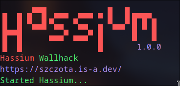
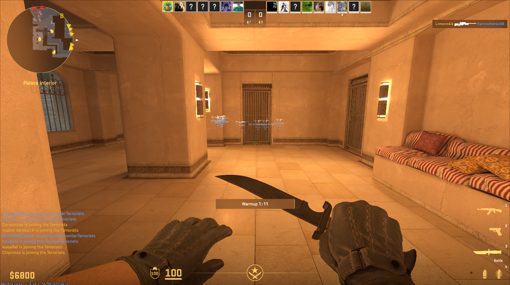

## Hassium Wallhack 

**A mindlessly pasted simple wallhack for Linux systems, stolen directly from [Sumandora](https://github.com/Sumandora/).**

**Note:** This program is pasted directly from [Sumandora](https://github.com/Sumandora/). Please use the original repo [here](https://github.com/Sumandora/cs2_one_byte_wallhack).

**How it works:**

This wallhack modifies game behavior by treating every player as a friendly entity. 
This results in the game displaying:

* **Overhead indicators** for all players, including enemies.
* **Used weapon information** for all players, including enemies.

**Pasted with ❤️ in Poland**

**Created with ❤️ in Germany**

**Disclaimer:** This wallhack may violate the game's terms of service. Use at your own risk.

**Download**

1. Compile from source

or

2. Use prebuild binaries in releases
